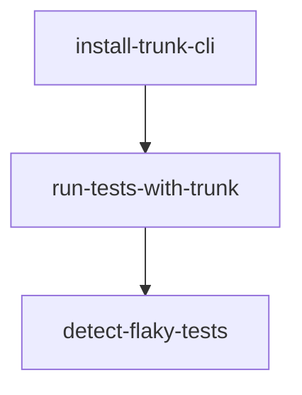

# Trunk CLI Flaky Test Detection Integration

This document explains how the Trunk CLI integration for flaky test detection works in CircleCI.

## Overview

The CircleCI configuration has been enhanced to include Trunk CLI for detecting flaky tests. This integration helps identify tests that pass or fail inconsistently, which can be a major source of CI/CD pipeline instability.

## How It Works

The integration consists of three main jobs:

1. **install-trunk-cli**: Downloads and installs the Trunk CLI
2. **run-tests-with-trunk**: Runs tests with JUnit reporting format
3. **detect-flaky-tests**: Uploads test results to Trunk for flaky test analysis

## Configuration

### Environment Variables

To use this integration, you need to set the following environment variable in your CircleCI project settings:

- `TRUNK_API_TOKEN`: Your Trunk.io API token for authentication

### Workflow

The `flaky-test-detection` workflow runs the three jobs in sequence:



## Test Execution

The `scripts/run-tests-with-trunk.sh` script runs both unit and E2E tests with JUnit reporting:

- Unit tests: `pnpm run test:unit -- --reporter=junit`
- E2E tests: `pnpm exec playwright test --reporter=junit`

Test results are saved in `apps/game/test-results/` directory as XML files.

## Flaky Test Detection

The `detect-flaky-tests` job uploads the JUnit XML test results to Trunk.io using the command:

```bash
./trunk flakytests upload --junit-paths "apps/game/test-results/*.xml" --org-url-slug cloudcrusaders --token "${TRUNK_API_TOKEN}"
```

## Usage

### Running the Workflow

1. Push changes to your repository
2. The `flaky-test-detection` workflow will automatically run
3. View results in the CircleCI dashboard
4. Check Trunk.io for flaky test analysis

### Manual Trigger

You can manually trigger the workflow from the CircleCI UI:

1. Go to your project in CircleCI
2. Click "Trigger Pipeline"
3. Select the `flaky-test-detection` workflow
4. Add any necessary parameters
5. Click "Trigger Pipeline"

## Requirements

- Node.js (for running tests)
- pnpm (package manager)
- Trunk CLI (automatically installed)
- Trunk.io account with API token

## Troubleshooting

### Common Issues

1. **TRUNK_API_TOKEN not set**: Ensure the environment variable is configured in CircleCI project settings
2. **No test results found**: Check that tests are running correctly and generating JUnit XML output
3. **Trunk CLI installation fails**: Verify network connectivity and retry

### Debugging

Add the following to any job to enable verbose output:

```yaml
- run:
    name: Debug information
    command: |
      echo "Current directory: $(pwd)"
      echo "Files in test-results: $(ls -la apps/game/test-results/ 2>/dev/null || echo 'Directory not found')"
      ./trunk --version
```

## Benefits

- **Early detection**: Identify flaky tests before they cause pipeline failures
- **Historical analysis**: Track test stability over time
- **Prioritization**: Focus on the most unstable tests first
- **Integration**: Seamless integration with existing CI/CD workflows

## Limitations

- Requires Trunk.io account and API token
- Only analyzes JUnit XML format test results
- Network connectivity required for uploading results

## Future Enhancements

- Add test retry logic for confirmed flaky tests
- Integrate with test quarantine systems
- Add notifications for newly detected flaky tests
- Support additional test result formats

## References

- [Trunk.io Documentation](https://docs.trunk.io)
- [Trunk CLI Flaky Tests](https://docs.trunk.io/flaky-tests)
- [CircleCI Documentation](https://circleci.com/docs)

---

_Last updated: 2024-01-11_
_Maintainer: CloudCrusader AI Assistant_
