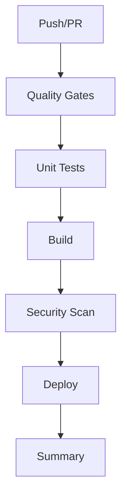

# CI/CD Quick Start Guide

## 🚀 Get Started in 5 Minutes

### 1. Required Secrets

Add these secrets to GitHub **Settings > Secrets > Actions**:

```bash
# Required
VERCEL_TOKEN=your_vercel_api_token

# Optional (for advanced features)
TURBO_TOKEN=your_turbo_token
AWS_ACCESS_KEY_ID=your_aws_key
AWS_SECRET_ACCESS_KEY=your_aws_secret
```

### 2. Required Variables

Add these variables to GitHub **Settings > Variables > Actions**:

```bash
TURBO_TEAM=your-team-name
```

### 3. Trigger Your First Pipeline

```bash
# Push to main branch (production deployment)
git push origin main

# Push to development branch (staging deployment)
git push origin development

# Create a PR (preview deployment)
git push origin your-feature-branch
```

## 📊 Pipeline Stages



## 🔑 Environment Variables Reference

| Variable       | Purpose            | Required |
| -------------- | ------------------ | -------- |
| `VERCEL_TOKEN` | Vercel API access  | ✅ Yes   |
| `TURBO_TOKEN`  | Turbo remote cache | ❌ No    |
| `GITHUB_TOKEN` | GitHub API access  | ✅ Auto  |
| `TURBO_TEAM`   | Turbo team name    | ❌ No    |

## 🎯 Common Commands

```bash
# Run quality checks locally
pnpm run workspace:check

# Run unit tests locally
pnpm run test:unit

# Build all packages
pnpm run build:all

# Check deployment status
gh run list --workflow=optimized-ci-cd.yml
```

## 🚨 Troubleshooting

**Cache issues?**

```bash
# Clear GitHub Actions cache manually via UI
# Or add this to your workflow temporarily:
env:
  CACHE_BUST: ${{ github.run_id }}
```

**Build failures?**

```bash
# Test build locally first
pnpm run build:all

# Check Turbo cache
pnpm turbo run build --dry
```

**Deployment issues?**

```bash
# Check Vercel token permissions
vercel whoami

# Test deployment locally
vercel
```

## 📖 Documentation

- [Full Setup Guide](CI_SETUP.md)
- [Workflow File](workflows/optimized-ci-cd.yml)
- [GitHub Actions Docs](https://docs.github.com/en/actions)
- [Vercel CI/CD](https://vercel.com/docs/concepts/git/deployments)

---

**Need help?** Open an issue or check the [full documentation](CI_SETUP.md)!
