# Game Mode State Flow Chart

## Overview

The Riddle Rush game application manages state across two interconnected dimensions:

1. **Route/Screen State** — which page/route is active (managed by Nuxt Router)
2. **Game Flow State** — where the game session is in its lifecycle (managed by `gameStore.ts`)

The single source of truth for game state is **`apps/game/stores/gameStore.ts`** (`useGameStore()`).  
The single source of truth for screen navigation is the **Nuxt Router** via `useNavigation()`.

---

## Single Source of Truth

| Concern | Owner | Location |
|---|---|---|
| Game session data | `useGameStore()` | `apps/game/stores/gameStore.ts` |
| Flow state (`setup → in-round → …`) | `useGameStore().flowState` getter | `apps/game/stores/gameStore.ts` |
| Game mode (single / multiplayer) | `useGameStore().gameMode` getter | `apps/game/stores/gameStore.ts` |
| Route / active screen | Nuxt Router | `apps/game/composables/useNavigation.ts` |
| Combined reactive access | `useGameState()` | `apps/game/composables/useGameState.ts` |

---

## States

### Game Flow States (`GameFlowState`)

Defined in `apps/game/stores/gameStore.ts`:

```typescript
export type GameFlowState = 'setup' | 'in-round' | 'round-complete' | 'decision' | 'completed'
```

| Flow State | Description | `currentSession` | `postRoundDecisionPending` | Round history |
|---|---|---|---|---|
| `setup` | No active session; players screen or fresh start | `null` | `false` | N/A |
| `in-round` | Active round; players submitting answers | non-null, `status: active` | `false` | `roundHistory.length < currentRound` |
| `round-complete` | All players submitted; waiting for score confirmation | non-null, `status: active` | `false` | `roundHistory.length >= currentRound` |
| `decision` | Scores confirmed; user decides next/finish | non-null, `status: active` | `true` | `roundHistory.length >= currentRound` |
| `completed` | Game finished; leaderboard visible | non-null, `status: completed` | `false` | all rounds recorded |

### Game Mode States (`gameMode`)

```typescript
gameMode: 'single' | 'multiplayer'
// Derived from: (currentSession?.players.length ?? 0) > 0 ? 'multiplayer' : 'single'
```

### Route / Screen States

| Route | Page | Description |
|---|---|---|
| `/` | `pages/index.vue` | Main menu |
| `/players` | `pages/players.vue` | Player setup |
| `/round-start` | `pages/round-start.vue` | Fortune wheel / category+letter selection |
| `/game/[gameId]` | `pages/game/[[gameId]].vue` | Active game round (answer submission) |
| `/results/[gameId]` | `pages/results/[[gameId]].vue` | Score entry & round decision |
| `/leaderboard` | `pages/leaderboard.vue` | Final leaderboard |
| `/settings` | `pages/settings.vue` | Settings |
| `/language` | `pages/language.vue` | Language selection |
| `/credits` | `pages/credits.vue` | Credits |
| `/splash` | `pages/splash.vue` | App loading splash |

---

## State Flow Chart

```mermaid
stateDiagram-v2
    direction LR

    [*] --> MainMenu : App Start / No Session

    %% ── Main Menu ────────────────────────────────────────────
    state MainMenu {
        direction TB
        PlayButton : PLAY button
        MenuPanel : MENU panel (toggle)
    }

    MainMenu --> PlayersSetup : Play clicked\n(goToPlayers)
    MainMenu --> Settings : Options / Settings clicked\n(goToSettings)
    MainMenu --> Language : Language clicked\n(goToLanguage)
    MainMenu --> Credits : Credits clicked\n(goToCredits)

    %% ── Settings / Language / Credits (all → back to menu) ──
    Settings --> MainMenu : Back
    Language --> MainMenu : Back
    Credits --> MainMenu : Back

    %% ── Player Setup ─────────────────────────────────────────
    PlayersSetup --> RoundStart : Players confirmed\n(setupPlayers → transitionToInRound)\nflowState: setup → in-round
    PlayersSetup --> MainMenu : Back

    %% ── Round Start (Fortune Wheel) ──────────────────────────
    RoundStart --> ActiveGame : Category & letter selected\n(advanceToConfiguredRound)\nnavigates to /game/[id]
    RoundStart --> MainMenu : Quit / Home

    %% ── Active Game ──────────────────────────────────────────
    ActiveGame --> ActiveGame : Player submits answer\n(submitPlayerAnswer)
    ActiveGame --> ScoringPage : All players submitted\n(transitionToRoundComplete)\nflowState: in-round → round-complete\nautomatically navigates to /results
    ActiveGame --> PauseOverlay : Pause button / ESC\n(showPauseModal = true)

    %% ── Pause Overlay (local component state) ────────────────
    PauseOverlay --> ActiveGame : Resume\n(showPauseModal = false)
    PauseOverlay --> MainMenu : Quit\n(clearSession / abandonGame)

    %% ── Scoring / Results Page ───────────────────────────────
    ScoringPage --> ScoringPage : Adjust scores\n(pendingScores map)
    ScoringPage --> DecisionModal : Confirm Scores\n(completeRound → transitionToDecision)\nflowState: round-complete → decision

    %% ── Decision Modal ───────────────────────────────────────
    DecisionModal --> RoundStart : Next Round\n(goToRoundStart)\nflowState: decision → in-round (on next setup)
    DecisionModal --> PlayersSetup : New Game\n(completeGame + goToPlayers)\nflowState: decision → completed
    DecisionModal --> Leaderboard : Leaderboard\n(completeGame + goToLeaderboard)\nflowState: decision → completed

    %% ── Leaderboard ──────────────────────────────────────────
    Leaderboard --> MainMenu : New Game\n(resets session)
    Leaderboard --> [*] : End

    %% ── Swimlane Notes ───────────────────────────────────────
    note right of ActiveGame
      flowState stays 'in-round'
      until all players submit
    end note

    note right of DecisionModal
      postRoundDecisionPending = true
      drives flowState = 'decision'
    end note
```



---

## Transition Rules

### Explicit Store Transitions

These methods on `useGameStore()` enforce the flow invariants:

| Method | From → To | Trigger |
|---|---|---|
| `transitionToSetup()` | any → `setup` | `clearSession()`, `abandonGame()` |
| `transitionToInRound()` | `setup/decision` → `in-round` | `setupPlayers()`, `startNextRound()`, `advanceToConfiguredRound()` |
| `transitionToRoundComplete()` | `in-round` → `round-complete` | `submitPlayerAnswer()` when all players submitted |
| `transitionToDecision()` | `round-complete` → `decision` | `completeRound()` after scores persisted |
| `transitionToCompleted()` | `decision` → `completed` | `completeGame()` |

### Route Navigation Triggers

| User Action | Navigation | Store Side-Effect |
|---|---|---|
| Click "PLAY" on main menu | `/` → `/players` | — |
| Confirm players on players page | `/players` → `/round-start` | `setupPlayers()` sets session + `transitionToInRound()` |
| Spin wheels & start round | `/round-start` → `/game/[id]` | `advanceToConfiguredRound()` |
| All players submit answer | auto: `/game/[id]` → `/results/[id]` | `transitionToRoundComplete()` |
| Confirm scores | (same page) | `completeRound()` → `transitionToDecision()` |
| Next Round | `/results` → `/round-start` | `startNextRound()` → `transitionToInRound()` |
| New Game | `/results` → `/players` | `completeGame()` → `transitionToCompleted()` |
| Leaderboard / Finish | `/results` → `/leaderboard` | `completeGame()` → `transitionToCompleted()` |
| Quit from pause overlay | `/game` → `/` | `abandonGame()` → session cleared |

### `flowState` Computation Logic

The `flowState` getter in `gameStore.ts` is **derived** — it has no independent storage:

```typescript
flowState(state): GameFlowState {
  const session = state.currentSession
  if (!session) return 'setup'
  if (session.status === 'completed') return 'completed'
  if (state.postRoundDecisionPending) return 'decision'
  if (this.isCurrentRoundCompleted) return 'round-complete'
  return 'in-round'
}
```

The two underlying state fields that drive it:
- `currentSession` — null check → `'setup'`
- `currentSession.status` — `'completed'` → `'completed'`
- `postRoundDecisionPending` — boolean flag → `'decision'`
- `isCurrentRoundCompleted` — derived from `roundHistory.length >= currentRound` → `'round-complete'`

---

## Implementation Access Patterns

### Reading State

```typescript
// In a component or composable:
import { useGameState } from '~/composables/useGameState'

const { gameMode, flowState, players, canConfirmRoundScores } = useGameState()

// flowState is a computed ref — use .value in script, or directly in template
if (flowState.value === 'in-round') { /* ... */ }
```

### Triggering Transitions

```typescript
// Direct store access for transitions:
import { useGameStore } from '~/stores/gameStore'
const store = useGameStore()

// Transition: round-complete → decision
await store.completeRound()

// Transition: decision → completed
await store.completeGame()

// Transition: any → setup
store.abandonGame()
```

### Navigation

```typescript
// Type-safe navigation via composable:
const { goToPlayers, goToRoundStart, goToGame, goToResults, goToLeaderboard } = useNavigation()

await goToRoundStart()         // → /round-start
await goToGame(sessionId)      // → /game/[id]
await goToResults(sessionId)   // → /results/[id]
await goToLeaderboard()        // → /leaderboard
```

---

## Architecture Notes

### What Works Well

1. **Single reactive store** — `useGameStore()` is the sole owner of session data. No duplicate stores.
2. **Derived `flowState`** — computed from minimal primitive state (`postRoundDecisionPending` + `currentSession.status` + round history length), making it easy to reason about.
3. **Explicit transition helpers** — named methods (`transitionToInRound`, `transitionToDecision`, etc.) document intent and make it greppable.
4. **`useGameState()` facade** — components don't need to know about the store layer split.

### Potential Improvements (Non-Breaking)

1. **No "pause" flow state** — Pausing is handled entirely via local component state (`showPauseModal = true` in `game/[[gameId]].vue`). This is intentional and correct for an overlay, but if pause should survive page refresh, it would need to be tracked in the store.

2. **Route and flow state are independent** — A user can navigate to `/results` while `flowState` is still `'in-round'`. The page guards check `flowState` on mount and redirect if needed. A future improvement could be route guards that enforce correct `flowState` for each route.

3. **`gameMode` ('single' | 'multiplayer') is implicit** — It's always derived from `players.length`, never explicitly set. This is clean, but makes it invisible when reading code. A JSDoc comment on the getter clarifies intent.

4. **`session.status` vs `flowState`** — Both track "completeness" but from different angles. `flowState` is the authoritative runtime concept; `session.status` is the persistence concept. They are kept in sync by `completeGame()` / `abandonGame()`.

---

## Testing State Transitions

```typescript
// Unit test example (Vitest + @pinia/testing):
import { setActivePinia, createPinia } from 'pinia'
import { useGameStore } from '~/stores/gameStore'

describe('Game Flow State', () => {
  beforeEach(() => setActivePinia(createPinia()))

  it('starts in setup state', () => {
    const store = useGameStore()
    expect(store.flowState).toBe('setup')
  })

  it('transitions to in-round after setupPlayers', async () => {
    const store = useGameStore()
    // mock category fetch
    store.categories = [mockCategory]
    await store.setupPlayers(['Alice', 'Bob'])
    expect(store.flowState).toBe('in-round')
  })

  it('transitions to round-complete when all players submit', async () => {
    const store = useGameStore()
    // ... setup session with players ...
    await store.submitPlayerAnswer(player1.id, 'apple')
    await store.submitPlayerAnswer(player2.id, 'apricot')
    expect(store.flowState).toBe('round-complete')
  })

  it('transitions to decision after completeRound', async () => {
    const store = useGameStore()
    // ... setup round-complete state ...
    await store.completeRound()
    expect(store.flowState).toBe('decision')
  })

  it('transitions to completed after completeGame', async () => {
    const store = useGameStore()
    // ... setup decision state ...
    await store.completeGame()
    expect(store.flowState).toBe('completed')
  })
})
```

---

## File Index

| File | Role |
|---|---|
| `apps/game/stores/gameStore.ts` | **Primary** — `GameFlowState` type, all state, all transitions |
| `apps/game/stores/hooks/useGameSession.ts` | Exposes store state as `ComputedRef` for composable ergonomics |
| `apps/game/composables/useGameState.ts` | Aggregates all hooks; component-facing API |
| `apps/game/composables/useGameActions.ts` | Wraps store actions with toast/audio side-effects |
| `apps/game/composables/useNavigation.ts` | Route navigation helpers |
| `apps/game/pages/index.vue` | Main menu — triggers `goToPlayers`, `goToSettings`, etc. |
| `apps/game/pages/players.vue` | Player setup — calls `setupPlayers()` |
| `apps/game/pages/round-start.vue` | Fortune wheel — calls `advanceToConfiguredRound()` |
| `apps/game/pages/game/[[gameId]].vue` | Active round — calls `submitPlayerAnswer()` |
| `apps/game/pages/results/[[gameId]].vue` | Scoring — calls `assignPlayerScore()`, `completeRound()`, `completeGame()` |
| `apps/game/pages/leaderboard.vue` | Final leaderboard — read-only |
