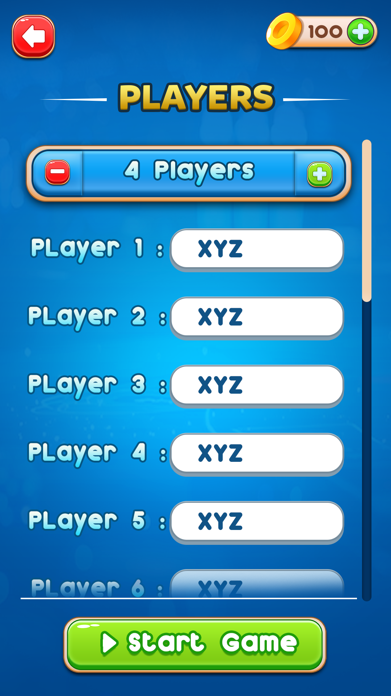
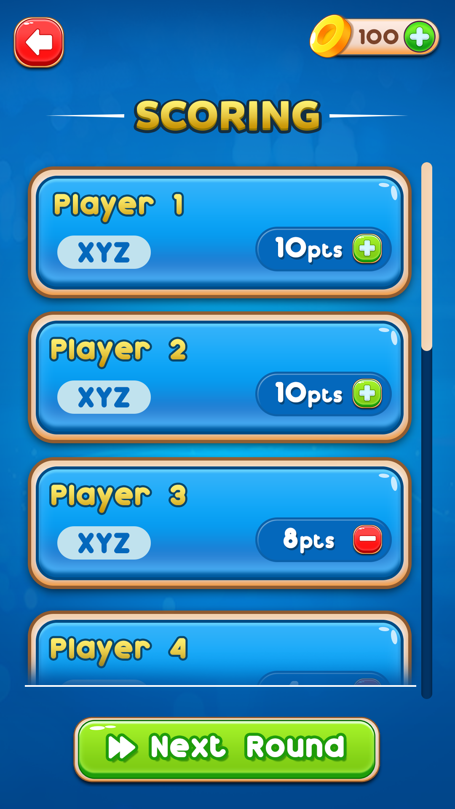
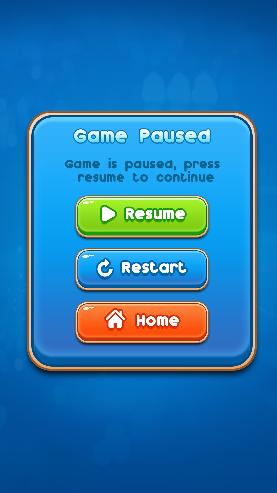

<div align="center">

# Riddle Rush

**A multiplayer party word game** — guess terms from Wikipedia categories starting with a chosen letter.

Built as a **pnpm + Turborepo** monorepo: Nuxt 4 PWA, shared packages, tooling, and AWS-ready infrastructure.

[](package.json)
[](https://github.com/CloudDevCrusader/riddle-rush-mono-repo/releases/latest)
[](https://github.com/CloudDevCrusader/riddle-rush-mono-repo/actions/workflows/deploy-prod.yml)
[](https://github.com/CloudDevCrusader/riddle-rush-mono-repo/actions/workflows/capacitor-mobile-artifacts.yml)
[](https://www.typescriptlang.org/)
[](https://nuxt.com/)
[](https://vuejs.org/)
[](https://nodejs.org/)
[](https://pnpm.io/)
[](LICENSE)

[Quick start](#quick-start) · [CLI](#cli) · [Design](#design-figma) · [Gallery](#ui-gallery) · [Commands](#command-cheat-sheet) · [Structure](#repository-layout) · [Docs](#documentation)


</div>

---

## Design (Figma)

UI and visual design are maintained in **Figma**. Use the file for layouts, components, and dev-mode specs when implementing or reviewing screens.

|                |                                                                                                                                              |
| -------------- | -------------------------------------------------------------------------------------------------------------------------------------------- |
| **Figma file** | [**Riddle Rush** (opens in browser)](https://www.figma.com/design/hINuFPjeXxAZVlbEQghd11/Riddle-Rush?node-id=0-1&m=dev&t=NiQrFrAR1ima9tvj-1) |
| **Canvas**     | Root frame `node-id=0-1` — switch to **Dev Mode** in Figma for measurements and CSS snippets                                                 |

**Repo asset layout**

| Location                                               | Purpose                                                                             |
| ------------------------------------------------------ | ----------------------------------------------------------------------------------- |
| [`docs/gfx/`](docs/gfx/)                               | Screen mockups and exported reference art (by flow: Main Menu, players, scoring, …) |
| [`apps/game/public/assets/`](apps/game/public/assets/) | Static assets served by the PWA (mirrors many `docs/gfx` exports at runtime)        |
| [`apps/game/assets/figma/`](apps/game/assets/figma/)   | Additional Figma export slices used in the Nuxt app                                 |

When design and code diverge, **Figma is the source of truth** for visuals; update exports and `public/assets` as needed.

---

## UI gallery

Reference mockups from `docs/gfx` (same look as in-game art from `public/assets`).

<table>
  <tr>
    <td align="center" width="50%">
      <br />
      <sub>Main menu</sub>
    </td>
    <td align="center" width="50%">
      <br />
      <sub>Players</sub>
    </td>
  </tr>
  <tr>
    <td align="center">
      <br />
      <sub>Scoring</sub>
    </td>
    <td align="center">
      <br />
      <sub>You win</sub>
    </td>
  </tr>
  <tr>
    <td align="center" colspan="2">
      <br />
      <sub>Paused</sub>
    </td>
  </tr>
</table>

---

## Highlights

|               |                                                                           |
| ------------- | ------------------------------------------------------------------------- |
| **Gameplay**  | 2–10 players, rounds with category + letter, scoring and leaderboards     |
| **Client**    | Nuxt 4 SPA/PWA, offline-friendly, IndexedDB for sessions and history      |
| **Platforms** | Web PWA; Android and iOS via Capacitor; NativeScript mobile app in-repo   |
| **i18n**      | German (default) and English                                              |
| **Quality**   | ESLint 9, Syncpack, Vitest, Playwright E2E, Husky hooks                   |
| **Ops**       | GitHub Actions CI/CD, Terraform for AWS (S3 + CloudFront), deploy scripts |

---

## Prerequisites

- **Node.js** ≥ 20
- **pnpm** ≥ 10 (repo pins `packageManager` — see root `package.json`)

---

## Quick start

```bash
git clone <repository-url>
cd riddle-rush-mono-repo
pnpm install
pnpm run dev
```

Open **[http://localhost:3000](http://localhost:3000)** for the game app.

---

## Command cheat sheet

| Goal                              | Command                    |
| --------------------------------- | -------------------------- |
| Dev server (game)                 | `pnpm run dev`             |
| All apps in parallel              | `pnpm run dev:all`         |
| Full quality gate (before commit) | `pnpm run workspace:check` |
| Auto-fix + format                 | `pnpm run workspace:fix`   |
| Unit tests                        | `pnpm run test:unit`       |
| E2E tests                         | `pnpm run test:e2e`        |
| Build game                        | `pnpm run build`           |
| Static generate                   | `pnpm run generate`        |
| Dead code                         | `pnpm run knip`            |
| Agent dashboard                   | `riddle stats`             |
| Validate before commit            | `riddle agent:validate`    |
| Auto-fix everything               | `riddle agent:fix`         |

---

## CLI

The repo ships a small oclif CLI at [`packages/riddle-cli`](packages/riddle-cli/) published as **`@riddle-rush/cli`**. It wraps the monorepo's quality gates, inspects installed AI agents / MCP servers, and reports Git state.

```bash
# build once from the repo root
pnpm --filter @riddle-rush/cli build

# run without global install
./packages/riddle-cli/bin/run.js --help

# or link globally for a bare `riddle` binary
cd packages/riddle-cli && pnpm link --global
```

| Command                   | Purpose                                                                  |
| ------------------------- | ------------------------------------------------------------------------ |
| `riddle stats`            | Dashboard of installed AI agents, their configs, API keys, and Git state |
| `riddle agent:validate`   | Pre-commit gate — Syncpack + TypeScript + ESLint                         |
| `riddle agent:fix`        | Auto-fix — Syncpack + ESLint + Prettier                                  |
| `riddle agent:status`     | Git status + unpushed commits + recommended next steps                   |
| `riddle agent:mcp-config` | Validate `.mcp.json` / `fastmcp.json` / Claude Desktop configs           |
| `riddle agent:mcp-health` | Smoke-test common MCP servers via `npx`                                  |

Full docs: [packages/riddle-cli/README.md](packages/riddle-cli/README.md).

---

## Repository layout

```text
riddle-rush-mono-repo/
├── apps/
│   ├── game/           # Main Nuxt 4 PWA
│   ├── mobile/         # NativeScript Vue
│   └── tolgee/         # Localization (Tolgee)
├── packages/
│   ├── config/         # Shared Vite/build config
│   ├── shared/         # Constants, routes, utilities
│   ├── types/          # Shared TypeScript types
│   └── riddle-cli/     # CLI
├── tools/              # Agents, scripts, integrations
├── infrastructure/     # Terraform (AWS)
├── docs/               # Guides and references
├── scripts/            # Deploy & utility scripts
├── .planning/          # Planning artifacts
├── specs/              # Specifications
└── openspec/           # OpenSpec
```

### Workspace packages

| Package               | Role                           |
| --------------------- | ------------------------------ |
| `@riddle-rush/game`   | Nuxt 4 game application        |
| `@riddle-rush/shared` | Shared utilities and constants |
| `@riddle-rush/types`  | Shared domain types            |
| `@riddle-rush/config` | Shared build configuration     |

---

## Documentation

**Indexes:** [docs/README.md](docs/README.md) (narrative index) · [docs/INDEX.md](docs/INDEX.md) (full link list)

### Repository root

| Doc                                                  | Description                                        |
| ---------------------------------------------------- | -------------------------------------------------- |
| [AGENTS.md](AGENTS.md)                               | AI/agent workflow, quality gates, testing, commits |
| [CLAUDE.md](CLAUDE.md)                               | Architecture overview and Claude Code notes        |
| [specs/README.md](specs/README.md)                   | Specifications entry point                         |
| [infrastructure/README.md](infrastructure/README.md) | Terraform / AWS infrastructure overview            |

### Getting started

- [docs/QUICK-START-ENHANCED.md](docs/QUICK-START-ENHANCED.md) — setup and first run
- [docs/DEVELOPMENT.md](docs/DEVELOPMENT.md) — day-to-day development
- [docs/MONOREPO.md](docs/MONOREPO.md) — monorepo layout and packages

### Architecture and code

- [docs/STRUCTURE.md](docs/STRUCTURE.md) — code organization
- [docs/WORKFLOW.md](docs/WORKFLOW.md) — game and dev workflow
- [docs/GAME-STATE-FLOW.md](docs/GAME-STATE-FLOW.md) — game state flow
- [docs/DESIGN.md](docs/DESIGN.md) — UI/UX and design system
- [docs/PLUGINS.md](docs/PLUGINS.md) — Vite and Nuxt plugins
- [docs/DEPENDENCY-MANAGEMENT.md](docs/DEPENDENCY-MANAGEMENT.md) — dependencies and Syncpack

### Testing and performance

- [docs/TESTING.md](docs/TESTING.md) — testing strategy
- [docs/TESTING-GUIDE.md](docs/TESTING-GUIDE.md) — detailed testing guide
- [docs/PERFORMANCE.md](docs/PERFORMANCE.md) — performance notes
- [docs/BUILD-OPTIMIZATION.md](docs/BUILD-OPTIMIZATION.md) — build tuning
- [docs/REFACTORING-GUIDE.md](docs/REFACTORING-GUIDE.md) — refactor patterns

### Deployment

- [docs/DEPLOYMENT.md](docs/DEPLOYMENT.md) — deployment overview
- [docs/DEVELOPMENT_DEPLOYMENT_GUIDE.md](docs/DEVELOPMENT_DEPLOYMENT_GUIDE.md) — dev/stage deploy
- [docs/VERCEL-DEPLOYMENT.md](docs/VERCEL-DEPLOYMENT.md) — Vercel
- [docs/deployment/AWS-DEPLOYMENT.md](docs/deployment/AWS-DEPLOYMENT.md) — AWS (S3 + CloudFront)
- [docs/deployment/AWS-IAM-SETUP.md](docs/deployment/AWS-IAM-SETUP.md) — AWS IAM
- [docs/deployment/DOCKER-DEPLOYMENT.md](docs/deployment/DOCKER-DEPLOYMENT.md) — Docker deploy
- [docs/deployment/DOCKER-CI-IMAGE.md](docs/deployment/DOCKER-CI-IMAGE.md) — CI Docker image

### Setup and tooling

- [docs/setup/HUSKY-TURBOREPO-SETUP.md](docs/setup/HUSKY-TURBOREPO-SETUP.md) — Husky + Turborepo
- [docs/setup/MONOREPO_ENVIRONMENT_GUIDE.md](docs/setup/MONOREPO_ENVIRONMENT_GUIDE.md) — environment variables
- [docs/setup/TERRAFORM-SETUP.md](docs/setup/TERRAFORM-SETUP.md) — Terraform
- [docs/setup/TERRAFORM-NUXT-INTEGRATION.md](docs/setup/TERRAFORM-NUXT-INTEGRATION.md) — Terraform ↔ Nuxt
- [docs/setup/AGENT-SETUP.md](docs/setup/AGENT-SETUP.md) — AI agent setup
- [docs/setup/AWS-IAM-SETUP.md](docs/setup/AWS-IAM-SETUP.md) — AWS IAM (setup)
- [docs/setup/ENV_MIGRATION_GUIDE.md](docs/setup/ENV_MIGRATION_GUIDE.md) — env migration
- [docs/development/AGENT-WORKFLOW.md](docs/development/AGENT-WORKFLOW.md) — agent workflow (docs)
- [docs/development/TOOLS-AND-AGENTS.md](docs/development/TOOLS-AND-AGENTS.md) — tools and agents
- [docs/USEFUL-PACKAGES.md](docs/USEFUL-PACKAGES.md) — curated packages

### Frontend and assets

- [docs/development/PWA-SPLASH-SCREEN.md](docs/development/PWA-SPLASH-SCREEN.md) — PWA splash
- [docs/ASSET-OPTIMIZATION.md](docs/ASSET-OPTIMIZATION.md) — asset pipeline

### Troubleshooting

- [docs/KNOWN-ISSUES.md](docs/KNOWN-ISSUES.md) — known limitations
- [docs/BUILD-ISSUES.md](docs/BUILD-ISSUES.md) — build problems
- [docs/troubleshooting/BROWSER-EXTENSION-ERRORS.md](docs/troubleshooting/BROWSER-EXTENSION-ERRORS.md) — browser extension noise in devtools

---

## Deployment

```bash
pnpm run deploy:dev   # Development environment
pnpm run deploy:prod  # Production
```

Infrastructure changes use the `infra:*` scripts in root `package.json` (Terraform per environment).

**Live:** production is served from **[riddlerush.de](https://riddlerush.de)** (see [AGENTS.md](AGENTS.md) for branch ↔ environment mapping).

### Downloads (release assets)

Each **semver tag** (`vX.Y.Z`) triggers [`.github/workflows/release.yml`](.github/workflows/release.yml), which builds mobile apps + CLI binaries and attaches them as **separate assets** to a [GitHub Release](https://github.com/CloudDevCrusader/riddle-rush-mono-repo/releases/latest). Every file has its own direct-download URL — nothing is bundled or zipped.

**Mobile**

| Asset                                 | Build                                                                  | Use for                               |
| ------------------------------------- | ---------------------------------------------------------------------- | ------------------------------------- |
| `riddle-rush-<version>-play.apk`      | `assemblePlayDebug` — ARM-only, debug-signed                           | Sideloading onto real Android devices |
| `riddle-rush-<version>-universal.apk` | `assembleUniversalDebug` — all ABIs (incl. x86)                        | Android emulators, low-volume testing |
| `riddle-rush-<version>.aab`           | `bundlePlayRelease` — signed (opt-in via `ENABLE_ANDROID_RELEASE_AAB`) | Play Store upload                     |
| `riddle-rush-<version>.ipa`           | iOS release archive (opt-in via `ENABLE_IOS_RELEASE`)                  | TestFlight / Ad-Hoc install           |

**CLI** — standalone tarballs with bundled Node runtime (run without installing Node):

| Asset                                           | Platform            |
| ----------------------------------------------- | ------------------- |
| `riddle-rush-cli-<version>-linux-x64.tar.gz`    | Linux x86-64        |
| `riddle-rush-cli-<version>-linux-arm64.tar.gz`  | Linux ARM64         |
| `riddle-rush-cli-<version>-darwin-x64.tar.gz`   | macOS Intel         |
| `riddle-rush-cli-<version>-darwin-arm64.tar.gz` | macOS Apple Silicon |
| `riddle-rush-cli-<version>-win32-x64.tar.gz`    | Windows x86-64      |

Extract and run:

```bash
# Linux / macOS
tar xzf riddle-rush-cli-<version>-<target>.tar.gz
./riddle/bin/riddle --help

# Windows (PowerShell)
tar -xzf riddle-rush-cli-<version>-win32-x64.tar.gz
riddle\bin\riddle.cmd --help
```

Cut a release with:

```bash
git tag v1.6.0 && git push origin v1.6.0
```

---

## Contributing

1. Read [AGENTS.md](AGENTS.md) for workflow and quality gates.
2. Keep changes focused; run `pnpm run workspace:check` before pushing.
3. Use **Conventional Commits** (`feat:`, `fix:`, `docs:`, …).
4. Open a PR for review.

---

## License

[MIT](LICENSE)
