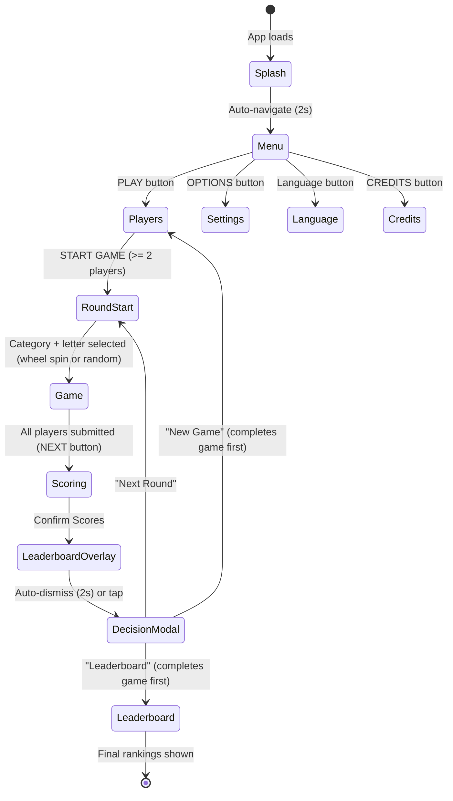

# Game State Flow

## State Machine



## Data Ownership

| Data                             | Owner                                               | Persisted |
| -------------------------------- | --------------------------------------------------- | --------- |
| Game session (id, status, round) | `stores/game.ts`                                    | IndexedDB |
| Players (names, scores, turns)   | `stores/game.ts` via `usePlayerManager`             | IndexedDB |
| Categories                       | `stores/game.ts` via `useCategoryManager`           | IndexedDB |
| Current round answer             | `player.currentRoundAnswer` in store                | IndexedDB |
| Pending round scores             | `pendingScores` (local in `results/[[gameId]].vue`) | No        |
| Show/hide modals                 | Local refs in page components                       | No        |
| Feature flags                    | `useFeatureFlags()` composable + `runtimeConfig`    | No        |
| User settings                    | `stores/settings.ts`                                | IndexedDB |

## Score Flow

```
Round N starts
  → Each player submits answer (stored as player.currentRoundAnswer)
  → Host goes to Scoring page
  → pendingScores starts at 0 for each player (LOCAL state)
  → Host clicks +/- to adjust pendingScores
  → projectedRanks computed: player.totalScore + pendingScores[id]
  → "Confirm Scores" calls gameStore.assignPlayerScore(id, points)
      → playerManager.assignPlayerScore: delta = points - currentRoundScore
      → player.totalScore += delta
      → player.currentRoundScore = points
  → gameStore.completeRound() records round history
  → PlayerLeaderboard overlay (2s)
  → Decision modal: Next Round / New Game / Leaderboard
```

## Composable Layers

```
Page Components (game.vue, results.vue, etc.)
    │
    ├── usePageSetup()      → router, t(), baseUrl, toast
    ├── useGameState()      → computed wrappers: players, leaderboard, currentRound, etc.
    ├── useGameActions()    → toast + navigation + store action dispatchers
    ├── useNavigation()     → route helpers (goToRoundStart, goToPlayers, etc.)
    ├── useFeatureFlags()   → isAnswerInputEnabled, isFortuneWheelEnabled, etc.
    └── useAudio()          → playClick, playScoreIncrease, etc.
            │
            └── stores/game.ts (Pinia)
                    │
                    ├── usePlayerManager()    → player mutations (score, turn, leaderboard)
                    ├── useCategoryManager()  → category fetching, random selection
                    └── useGameLifecycle()    → session create/complete, round management
                            │
                            └── useIndexedDB()  → persistence layer
```
